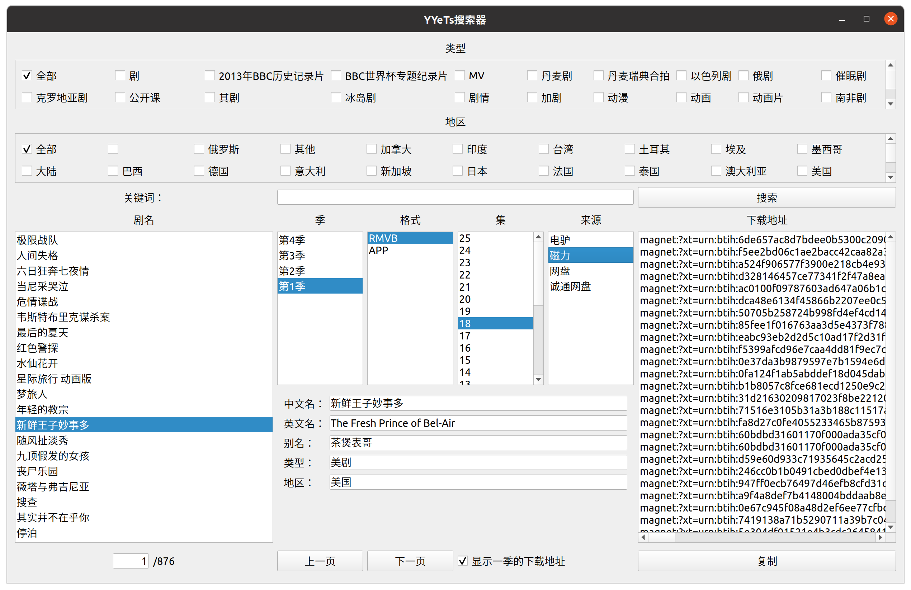

# YYeTs搜索器

根据开源的YYeTs数据库进行搜索

## 准备工作

1. 安装MongoDB（[官网](https://docs.mongodb.com/manual/installation/)）
2. 下载YYeTs的MongoDB数据库文件（[链接](https://github.com/tgbot-collection/YYeTsBot/blob/master/DEVELOPMENT.md)）
3. 导入数据库
```bash
mongorestore --gzip --archive=yyets_mongo.gz
```
4. 启动MongoDB
```bash
sudo systemctl start mongod
```

## qt搜索器

1. 安装依赖
```bash
pip install -r requirements.txt
```

2. 运行程序
```bash
python qt_searcher.py
```

预览：
